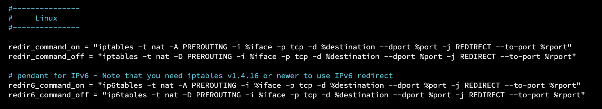
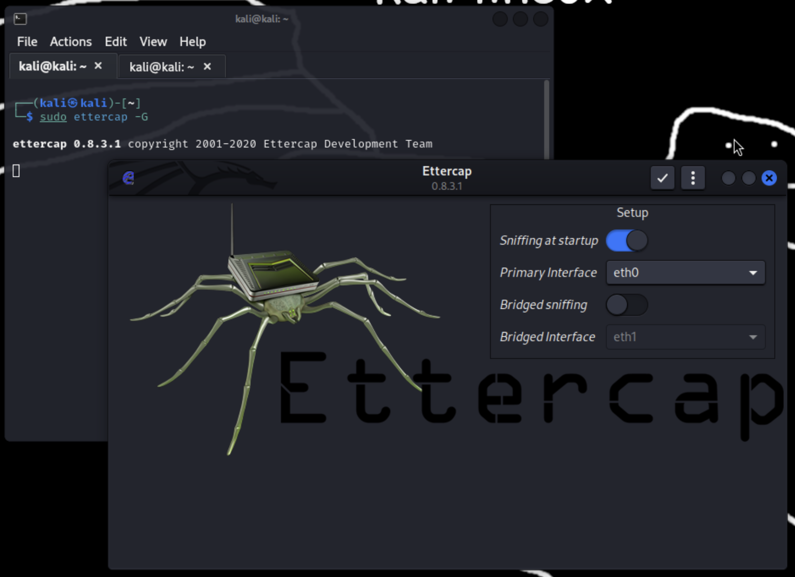
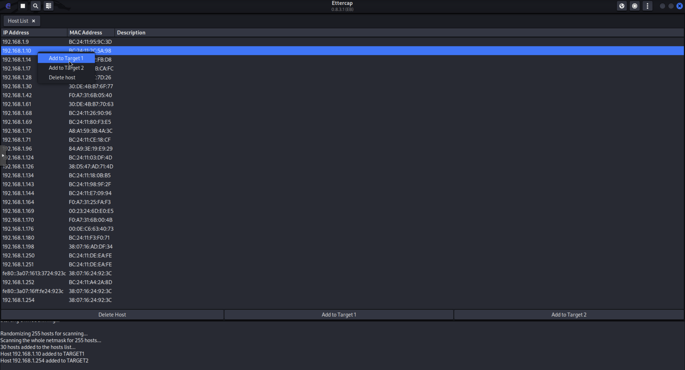
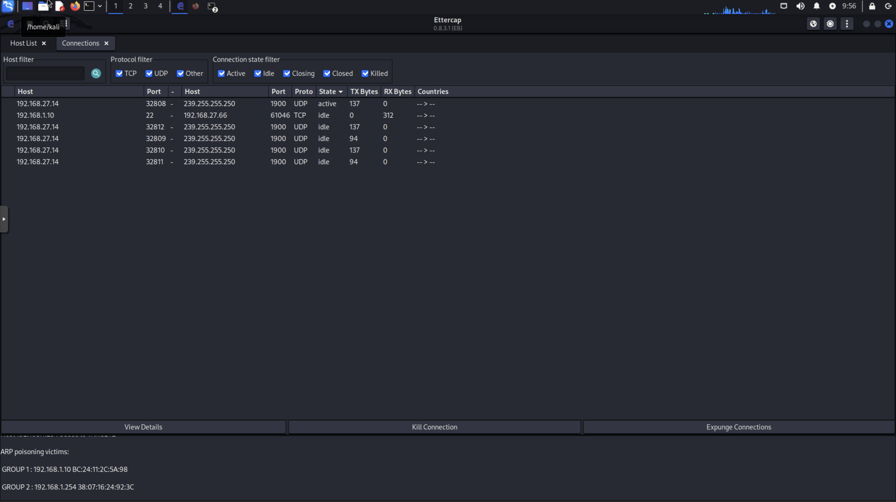
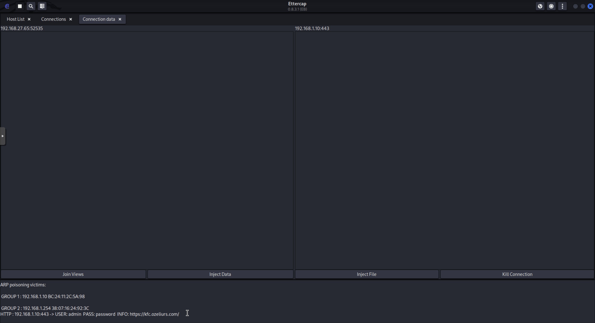

# Network Security Lab

This repository contains the lab assignments and our solutions for the Network Security course at Polytech Nice Sophia.

[BEDINO Tom](https://github.com/BedinoTom) - [BILLY Maxime](https://github.com/ozeliurs) - [STANISLAS Mélanie](https://github.com/melaniestnls)

## Lab 1: Apache Server and MITM

### Part 1: Virtual Machine Setup

### Part 2: Apache Install

### Part 3: UFW Firewall

### Part 4: MITM with Ettercap

First we need to configure Etttercap, we need to edit the configuration file `/etc/ettercap/etter.conf` and uncomment the `redir_*` line.

We then start Ettercap with `sudo ettercap -G` and select the network interface we want to use.

We then start a new scan and select the target we want to attack.

Then we start the MITM attack by selecting the `ARP poisoning` option.

We can now see the traffic between the target and the gateway. Here we see the password of the target.

We can see on the client that the certificate has changed and that it is not trusted.

`<insert image>`
